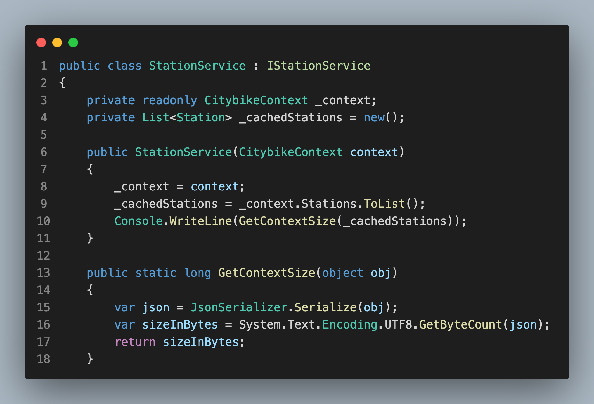

# Helsinki city bike app

## Introduction

This project works as a ("working as a software developer / ohjelmistokehittäjänä toimiminen") project. The goal of this project was to demonstrate my ability to develop a software project based on given specifications. The project is built with .NET and Blazor, and it serves as a testament to my skills as a developer.

(This project is based on a pre-assignment for Solita's Dev Academy.)

## Table of Contents

- [Exercise](#exercise)
- [Implementation](#implementation)
- [Testing](#testing)
- [Database Structure](#database-structure)
- [Conclusion](#conclusion)

## Exercise and Functional Requirements

The assignment was to create a web application that uses a backend service to fetch data. The functional requirements for this project were as follows:

### Station List

- List all stations
- Link to single station views

### Single Station View

- Display the station name
- Display the station address
- Show the total number of journeys starting from the station
- Show the total number of journeys ending at the station
- Show the average distance of journeys starting from the station
- Show the average duration of journeys starting from the station

## Implementation

For this project, I decided to use .NET Blazor. The architecture of Blazor fits well with a relatively small project like this, while still providing the possibility to scale if ever needed.

### Station List Implementation

The Station List uses pagination and supports filtering/searching by station names. The stations can also be ordered alphabetically.

### Single Station View Implementation

In the Single Station View, I display all the required data. In addition to the requirements, I added the station location using the OpenStreetMap API and a peak hours graph that displays the number of journeys at specific times.

### Journeys List Implementation

I also added a journeys list that displays information about journeys taken. This list can be ordered based on duration, distance, or station names, and it supports offset based pagination.

### Technologies Used

- .NET
- Blazor
- Docker
- Entity Framework
- Postgresql
- Tailwind css

### Approach

I used Microsoft Entity Framework ORM for the database operations. Since I was provided with a pre populated database, I used the automatic data modeling (`scaffolding`) to create the models and relationships in the ORM.

I decided to go with a Monolithic architecture since this project wasn't too complex. However, to ensure a clean separation of concerns and maintainability, I divided the business logic into different services for handling station and journey data. These services are scoped, which allows for data caching to improve performance by reducing the number of database queries, while still refreshing often enough to prevent data from becoming stale in a production environment.

For the frontend, I used a component-based approach. This helped to keep individual pages from becoming too bloated and complicated, and it also helped to separate concerns. By breaking down the application into smaller, reusable components, I was able to maintain a clean and organized codebase.

## Testing

### Manual testing

During development I conducted extensive manual testing to ensure the functionality and reliability of the application. I tested each feature individually and tried to test for all edge I could think of. This included testing the responsiveness to ensure a good user experience on a variety of screen sizes and devices. Below you can find more detailed explanations of few tests.

#### Station data caching

I tested the size of the cached stations in StationService to determine if the caching would be too memory expensive. The byte size came out of 90905 so around 90KB which is very reasonable object size to store in memory so I decided to use the caching in order to make the ordering and filtering methods faster.



#### Pagination

While testing the pagination of journeys data I noticed that the program would crash if pagination button was clicked too fast. The crash was caused by the asynchronous method that fetched the next journeys from database. The issue arose when this method was triggered while it was already running.

To solve this issue I introduced a boolean variable `isProcessing`. This variable is set to `true` when the data fetching method starts running, and set back to `false` once the method has finished. If `isProcessing` is `true`, the pagination button is disabled, preventing the data fetching method from being triggered again until the current fetch operation has completed.

#### Station search field

During development of the search field on landing page, I encountered an issue where the dropdown would disappear before the `onclick` event would trigger, preventing the links in the dropdown from working.

Initially, I attempted to solve this issue by preventing the default behavior of the component. However, I was unable to get this approach to work.

I then decided to go with a delay on the `onblur` attribute to keep the dropdown visible long enough for the `onclick` event to trigger. This was achieved by using the `Task.Delay` method.

### Automated Testing

In the `StationServiceTests.cs` file, I have implemented automated tests to ensure the correct functionality of the methods in the `StationService`.

The `StationServiceTests` class uses the `Xunit` testing framework and the `Moq` mocking framework. It also uses an in-memory database provided by Entity Framework Core, which allows for testing database-related code without the need for an actual database.

The `StationServiceTests` constructor sets up a new in-memory database and a new instance of `StationService` for each test. The `Dispose` method ensures that the database is deleted after each test, providing a clean state for each test case.

## Database structure

Database consists of two tables: station and journey.

### Station table

| Column          | Description                 | Type                          |
| --------------- | --------------------------- | ----------------------------- |
| id              | id, primary key             | integer                       |
| station_name    | Name of the station         | character varying(100) _NULL_ |
| station_address | Address of the station      | character varying(100) _NULL_ |
| coordinate_x    | X coordinate of the station | character varying(100) _NULL_ |
| coordinate_y    | Y coordinate of the station | character varying(100) _NULL_ |

### Journey table

| Column               | Description                    | Type                               |
| -------------------- | ------------------------------ | ---------------------------------- |
| id                   | id, primary key                | integer                            |
| departure_date_time  | Journey start timestamp        | timestamp _NULL_                   |
| return_date_time     | Journey end timestamp          | timestamp _NULL_                   |
| departure_station_id | Journey start station          | integer, references to station(id) |
| return_station_id    | Journey end station            | integer, references to station(id) |
| distance             | Distance of journey in meters  | integer _NULL_                     |
| duration             | Duration of journey in seconds | integer _NULL_                     |

## Conclusion

I am pleased with how this project turned out. This was definitely interesting project to work on that allowed me to delve deeper into .NET and Blazor.

The project not only met the customer's requirements but also included additional features that I believe users would find both interesting and useful. The implementation of business logic and database operations, as well as the integration of a third-party API (OpenStreetMap), added depth and functionality to the application.

Using Git for version control allowed me to effectively manage and track changes in the codebase, and made it easier to apply bigger changes to the application. The use of Docker also ensures that the final product is easy deploy and further enhances the project's further development.

Overall, this project was a valuable learning experience and a good opportunity to display my skills as a software developer.

## Instructions to run the project locally

1. Make sure you have docker installed
2. Clone this repository
3. On command line under this folder run:

```
docker compose up --build
```

Please note that running that might take couple of minutes

4. App is running and accessible at localhost:3000
